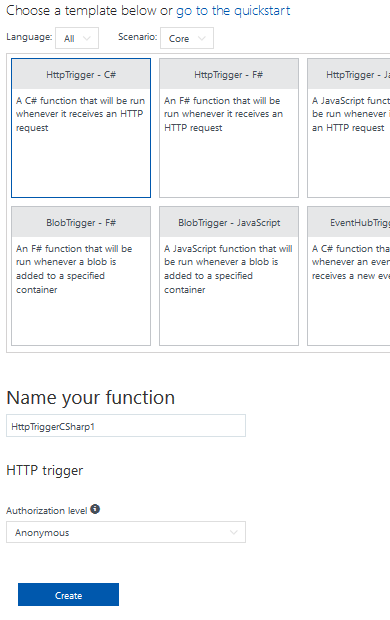
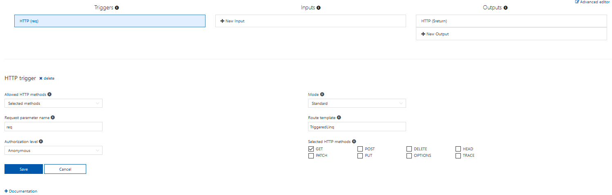
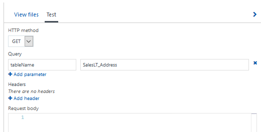
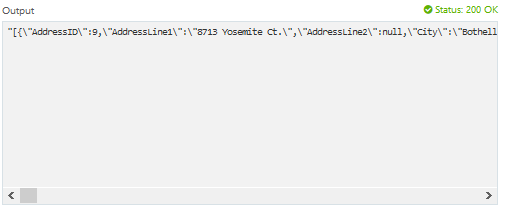
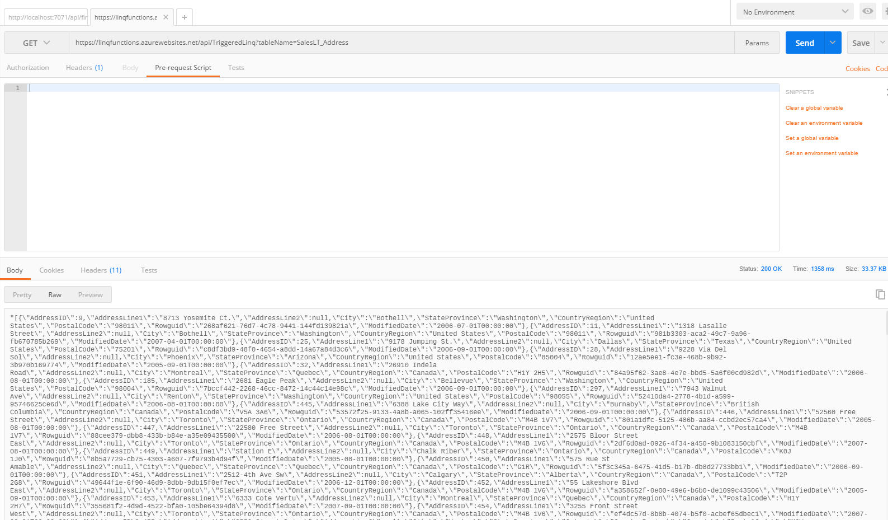

# Using LINQ in an HTTP triggered Azure function
> NOTE. This is a follow up repo on how to use LINQ on Azure Functions to quickly access a SQL database. If you want to take a look at a more complete guide on how to use Azure Functions and LINQ step by step I recommend you to take a look at <a href="https://github.com/JorgeCupi/LINQ_AzureFunctions/">this repo</a> for starters with LINQ and Azure Functions.

In this repo we will take a quick look at how to transform simple HTTP POST requests into actions on a SQL Database hosted in Azure.

## Creating our 'base' function template
Remembering what we've done in the previous repo, we will:
- Use an Adventure Works database hosted in SQL Azure services.
- Use SqlMetal.exe tool for mapping purposes to obtain a 'mappedClasses.cs' file containing our whole database tables transformed into classes.
- Upload our mappedClasses.cs file to each function we will create.
- Add references:
    - System.XML.Linq in the mappedClasses.cs file
    - System.Data.Linq, System.Data, System.Configuration to our Run.csx file
    - Load mappedClasses.cs file in Run.csx file

What will be different? The previous repo was using Azure Functions' manual trigger. This time we will use the 'HTTP Trigger' template when creating our new functions:



> NOTE. For this repo and set of examples we will select an 'Anonymous' authorization level. A next post will show the differences of Authorization levels and how to handle them.

After adding references to the missing libraries our base function should look like this:
```csharp
#r "System.Data.Linq"
#r "System.Data"
#r "System.Configuration"
#load "mappedClasses.cs"

using System.Net;
using System.Configuration;

public static async Task<HttpResponseMessage> Run(HttpRequestMessage req, TraceWriter log)
{
    /// Some generated code here...
}
```

Remember the manual activated functions?
```csharp
public static void Run(string input, TraceWriter log)
{
    // Some code here...
}
```

The biggest and main difference to our current functions is that now we return an HTTPResponseMessage object. And how do we return it? Well, thanks to the power of Azure Functions' output bindings, returning the object is as simple as writing:
```csharp
return req.CreateResponse(HttpStatusCode.OK, "Some message to return.");
```
> TIP. You can learn more about Azure Functions' bindings <a href="https://docs.microsoft.com/en-us/azure/azure-functions/functions-triggers-bindings">reading this documentation</a>.

## Querying our database ##
Now that we have our function foundations in place. We'll see that making a request to our database is not that hard. First, we have to check if our function is able to receive a GET request. We can do this by going to the 'Integrate' option in our function and review the settings for the 'Triggers' part:



What can we learn from this trigger settings?
- We can customize the HTTP methods that will be enabled for our function trigger
- We can modify the HTTP Request object name (the default name is 'req')
- We can modify this HTTP trigger and convert it to a Webhook by changing the 'Mode' option
- The 'Route template' option allows us to change the URL route that our function will have
- We can change the authorization level of our function trigger at any time

> NOTE. For now it is not necessary to enable all HTTP methods as querying our database will probably be handled a GET methods only. The other values of the settings page will not be changed as well.

Finally, now we can start to write our Http Trigger to Database code. Remember we first need to access our database via connection string:
```csharp
string connString = ConfigurationManager.ConnectionStrings["connString"].ConnectionString;
Functionsdb db = new Functionsdb(connString);
```
>TIP. If you haven't checked at the previous repo yet. Adding a connection string is as simple as going to your Function App's settings, find the "Connection strings" sub menu and adding your database connection string.

Now, for this example, we might want to access an 'X' table whose name should come as a query in our HTTP request. Let's grab that name with the following code:

```csharp
string name = req.GetQueryNameValuePairs()
        .FirstOrDefault(q => string.Compare(q.Key, "tableName", true) == 0)
        .Value;

dynamic queryResult = null;
string jsonResult = String.Empty;

```
We are also declaring two variables:
- A dynamic 'queryResult' which will come handy since the objects to be serialized will vary depending on the tableName that will be sent by our users
- a 'jsonResult' string that we will use to deserialize our list of objects (tables) and then return in our HTTP request as a string.

Now it is just a matter of checking which table should we query depending on the 'name' value: 
```csharp
if(name=="SalesLT_Address")
        queryResult = (from item in db.SalesLT_Address select item).ToList();
    
if (name=="SalesLT_SalesOrderDetail")
    queryResult = (from item in db.SalesLT_SalesOrderDetail select item).ToList();

// More if statements (there's chance of refactoring here)
```
Finally, we return the queryResult as a json string:
```csharp
try
{
    jsonResult = JsonConvert.SerializeObject(queryResult);
    return req.CreateResponse(HttpStatusCode.OK, $"{jsonResult}");
}
catch
{
    jsonResult = $"Sorry, I can't find the {name} table at the database";
    return req.CreateResponse(HttpStatusCode.BadRequest, $"{jsonResult}");
}
```

The complete function will look like this:
```csharp
#r "System.Data.Linq"
#r "System.Data"
#r "System.Configuration"
#r "Newtonsoft.Json"
#load "mappedClasses.cs"

using System.Net;
using System.Configuration;
using Newtonsoft.Json;
using System.Collections.Generic;

public static HttpResponseMessage Run(HttpRequestMessage req, TraceWriter log)
{
    string connString = ConfigurationManager.ConnectionStrings["connString"].ConnectionString;
    Functionsdb db = new Functionsdb(connString);

    string name = req.GetQueryNameValuePairs()
        .FirstOrDefault(q => string.Compare(q.Key, "tableName", true) == 0)
        .Value;
    dynamic queryResult = null;
    string jsonResult = String.Empty;

    if(name=="SalesLT_Address")
        queryResult = (from item in db.SalesLT_Address select item).ToList();
    
    if (name=="SalesLT_SalesOrderDetail")
        queryResult = (from item in db.SalesLT_SalesOrderDetail select item).ToList();
    
    try
    {
        jsonResult = JsonConvert.SerializeObject(queryResult);
        return req.CreateResponse(HttpStatusCode.OK, $"{jsonResult}");
    }
    catch
    {
        jsonResult = $"Sorry, I can't find the {name} table at the database";
        return req.CreateResponse(HttpStatusCode.BadRequest, $"{jsonResult}");
    }
}
```

Let's try if our function is really working. We have to click the "Test" tab in the upper right side of our page:



On the 'Query' part let's put the 'tableName' query name and 'SalesLT_Address' as our value and click on the 'Run' button to see the results:



If we use a different tool to test HTTP request like <a href="https://www.getpostman.com/">Postman</a> we will have the same results:


### Beware of an endless serialization loop ###
If you will use the mappedClasses.cs generated classes you will have to delete some objects that would cause a loop in the JsonConvert.SerializeObject method. In this current example we deleted the next attributes from the SalesLT_Address because said objects contained SalesLT_Address objects within them:
```csharp
private EntitySet<SalesLT_CustomerAddress> _SalesLT_CustomerAddress;
	
private EntitySet<SalesLT_SalesOrderHeader> _SalesLT_SalesOrderHeader;
	
private EntitySet<SalesLT_SalesOrderHeader> _Address;
```


## Adding a new row to a table ##
## Updating a row ##
## Deleting a row in a table ##
## Conclusion ##